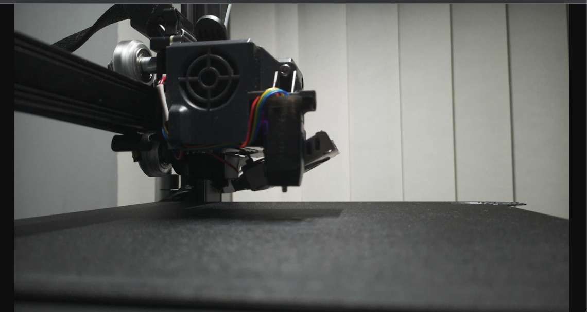
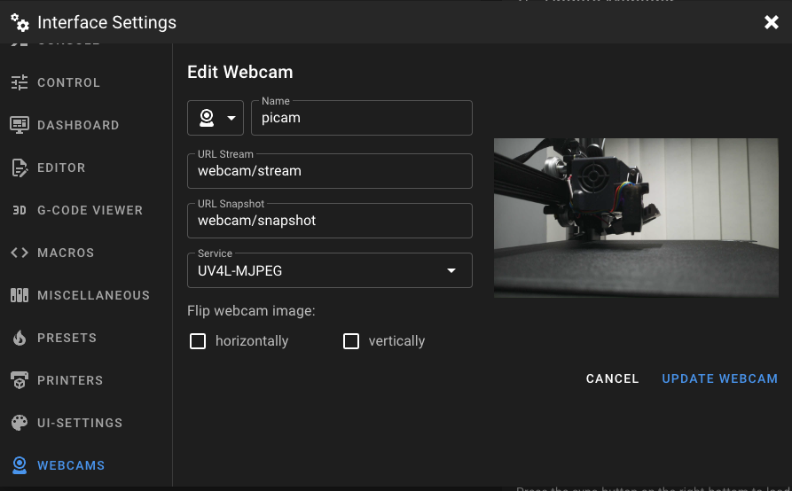

> ⚠️ This post is over a year old.
>
> ⚠️ Please refer to [How to setup a Raspicam?](https://crowsnest.mainsail.xyz/faq/how-to-setup-a-raspicam) for more relevant information.

---

I recently decided to pick up a Pi Camera Module 3 to add to use with Mainsail for my Ender S1... Unfortunately this wasn't as straight forward as I was hoping for it to be.

As it turns out, the camera module 3 isn't supported in crowsnest as yet - but someone has created [Spyglass](https://github.com/roamingthings/spyglass) to act as a middleware layer allowing you to add a camera into Mainsail.

To start with, you need to make sure you meet the prerequisites as below:

1. Raspberry Pi OS Bullseye (or MainsailOS running on Bullseye, it’s built on Raspberry Pi OS Lite)
2. Picamera2 - Already installed on Raspberry Pi OS Bullseye
3. Python 3.8+
4. A camera supported by libcamera and connected to the Raspberry Pi

I quickly realised I didn't meet (1) which incidentally meant that whilst (2) was installed it wasn't the OS default Python version.

I tried to change it on my existing install, but after a chat with a friend mid wracking my brain on why it wouldn't work, we came to the decision it was just damn easier to reinstall MainsailOS to the latest version which instantly fixed both issues.

*Progress...*

As a side note, when you install MainsailOS, I'd recommend you disable the default camera configuration in the `crowsnest.conf` file, otherwise it'll spam your journalctl with thousands of entries. I definitely didn't get caught out by that and end up with a full disk due to it...

So now that we've met the prerequisites, we can test the camera module:

```
pi@mainsailos:~ $ libcamera-hello
ERROR: the system appears to be configured for the legacy camera stack
```

Hmm, that's not what we were expecting. After some more digging, I found the solution to this is to modify the `/boot/config.txt` to add our own `dtoverlay`. You'll need to use sudo to edit this file so `sudo nano /boot/config.txt` and then add the following, save the file and then reboot:

```
#Camera Module 3 (IMX708)
dtoverlay=imx708
```

After a reboot, we can test the camera again:

```
pi@mainsailos:~ $ libcamera-hello
Preview window unavailable
[0:01:07.618405273] [1219]  INFO Camera camera_manager.cpp:299 libcamera v0.0.3+40-9b860a66
[0:01:07.760731495] [1220]  INFO RPI raspberrypi.cpp:1425 Registered camera /base/soc/i2c0mux/i2c@1/imx708@1a to Unicam device /dev/media4 and ISP device /dev/media1
[0:01:07.761912773] [1219]  INFO Camera camera.cpp:1028 configuring streams: (0) 2304x1296-YUV420
[0:01:07.762349588] [1220]  INFO RPI raspberrypi.cpp:805 Sensor: /base/soc/i2c0mux/i2c@1/imx708@1a - Selected sensor format: 2304x1296-SBGGR10_1X10 - Selected unicam format: 2304x1296-pBAA
#0 (0.00 fps) exp 29981.00 ag 1.75 dg 1.00
#1 (30.01 fps) exp 29981.00 ag 1.75 dg 1.00
#2 (30.01 fps) exp 29981.00 ag 1.75 dg 1.00
#3 (30.01 fps) exp 29981.00 ag 1.73 dg 1.00
#4 (30.01 fps) exp 29981.00 ag 1.72 dg 1.00
```

Much better - the camera is now available - onto getting Spyglass working. So, `git clone` the repo to your MainsailOS instance, `cd` into the directory and test launch it via:

```
pi@mainsailos:~/spyglass $ ./run.py -r 1920x1080
```

You should now be able to browse to `http://yourPiIP:8080/stream` and view the stream from your camera:



Alright, now, still in the spyglass directory run `make install` and then reboot. You can now add the camera via the web interface:



That's about it. You've got your Pi Camera Module 3 setup and available. Now you can edit your `spyglass.conf` under your config directory to set things such as the resolution. Hopefully crowsnest supports the Camera 3 soon, but in the meantime, there's Spyglass.

✌️
